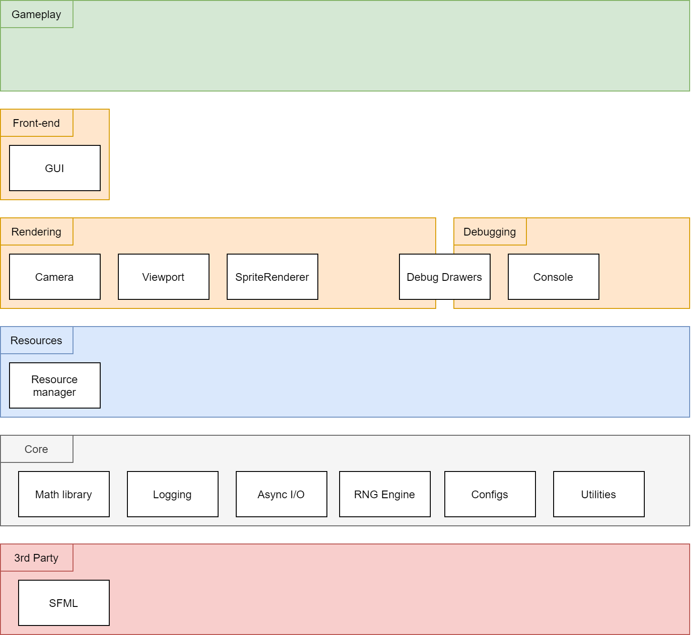

# Bloodstone

Proof of concept: Game Engine temporary based on SDL2.

Current feature set:
* Component-based game entities architecture
* Dynamic configuration parser (`JSON`)
* Custom math
* Custom time measurement classes
* Rendering & window `SDL2` wrapper
* Dynamically loading assets
* Assets configuration parsing
* Fixed timestamp main loop and fps lock
* Simple scene system
* Custom keyboard handling

Simple demo of technology for assignment on University of Lower Silesia.  
Future development plans:
* Native window framework
* Custom rendering framework
* Physics 
* Front-end GUI components
* Editor
* Debugging & profiling tools

# Planned scheme

# How to?
1. Clone repository
2. Run `cmake` (provide path to SDL2 - [see example settings](https://github.com/Ursanon/Bloodstone/blob/master/CMakeSettings.json))

# Download latest release
Head to [Releases](https://github.com/Ursanon/Bloodstone/releases)